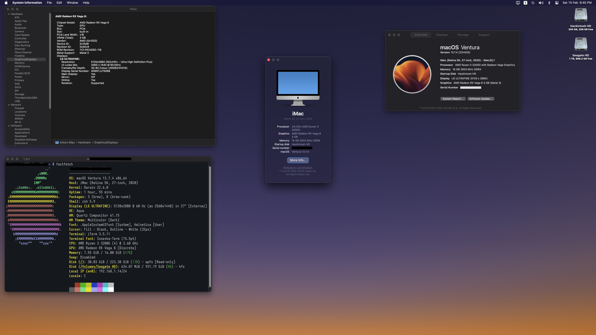

# Hackintosh EFI for AMD Ryzen 3200G Vega 8

## Screenshot

## System Configuration

**CPU:** AMD Ryzen 3 3200G\
**GPU:** Vega 8 (Integrated)\
**Motherboard:** ASUS-EXA320M GAMING\
**RAM:** 16GB (2x PNY M4U04S681LJJJ43-12 4GB, 2x Crucial CT4G4DFS8266.M8FF both OC to 2933Mhz)\
**Storage:** Crucial CT240BX500SSD1 240GB, Seagate ST1000DM003-1ER162 1TB\
**Bluetooth:** TP Link UB400\
**Display:** LG Ultrafine 4K\
**macOS Version:** Ventura 13.7.4\
**OpenCore Version:** 1.0.3

## Working ✅

- Almost everything

## Issues 🚧

- DRM & Hardware Video Decoding (NootedRed issue)
- Wi-Fi (don't have a card in my system)

## Installation Instructions 📖

1. Copy the `EFI` folder to your EFI partition.
2. Make necessary SMBIOS modifications using **ProperTree** & **GenSMBIOS**.
3. Disable **Secure Boot**, **Above 4G Decoding** and **Reisze BAR Support** in BIOS.
4. Use `iMac20,1` as SMBIOS for best compatibility.
5. Set UMA Framebuffer size to 3G in BIOS.

## Notes ⚠️

- This EFI is built for **Ryzen 3200G** with **Vega 8** iGPU.
- It may not work on other configurations without modifications.
- Backup your existing EFI before replacing it.

